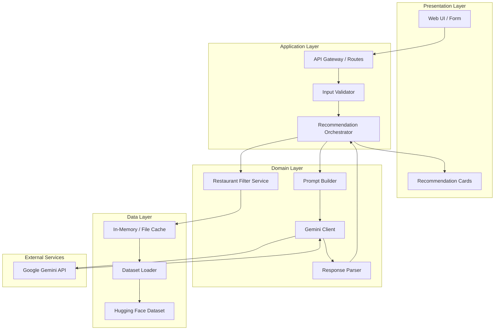
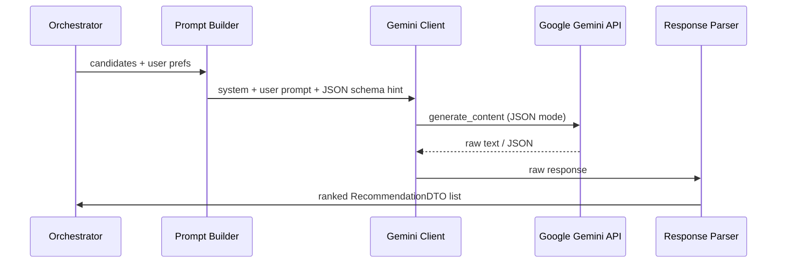
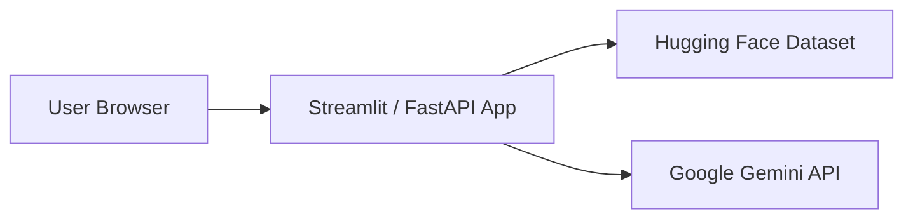
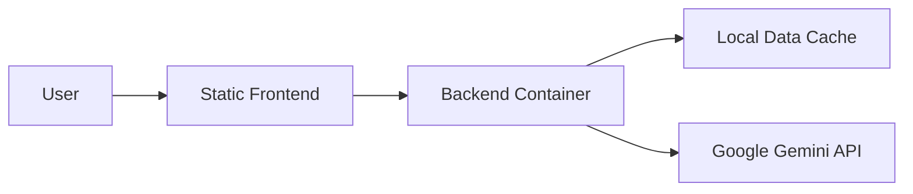

# Architecture: AI-Powered Restaurant Recommendation System

> Derived from [context.md](./context.md) · Zomato-inspired recommendation service

## 1. Purpose

This document describes the **system architecture** for an application that recommends restaurants by combining:

1. **Structured filtering** over a real Zomato dataset (Hugging Face)
2. **Google Gemini–powered ranking and explanation** for personalized, human-readable output

The architecture is designed to satisfy all workflow stages defined in the project context while keeping components loosely coupled and testable. **Google Gemini** is the sole LLM for this project.

---

## 2. Architectural Goals

| Goal | Rationale |
|------|-----------|
| **Separation of data and reasoning** | Restaurant facts come from the dataset; the LLM ranks and explains—never invents restaurants |
| **Deterministic pre-filtering** | User criteria (location, budget, rating) applied before LLM to reduce cost, latency, and hallucination risk |
| **Prompt stability** | Structured JSON in / structured JSON out for reliable parsing |
| **Simple deployability** | Suitable for a milestone demo: single backend + lightweight UI |
| **Extensibility** | Clear boundaries so auth, caching, and vector search can be added later |

---

## 3. High-Level Architecture



### Layer Responsibilities

| Layer | Responsibility |
|-------|----------------|
| **Presentation** | Collect preferences, show loading state, render ranked recommendations |
| **Application** | HTTP/API boundary, validation, request orchestration, error mapping |
| **Domain** | Filtering logic, prompt construction, Gemini interaction, result normalization |
| **Data** | Load, clean, normalize, and cache restaurant records |
| **External** | Google Gemini API (via `google-generativeai` SDK) |

---

## 4. Recommended Technology Stack

The following stack is aligned with the workflow. **LLM provider is fixed to Google Gemini** for this project.

| Concern | Choice | Notes |
|---------|--------|-------|
| **Backend** | Python 3.11+ with FastAPI | Flask acceptable alternative |
| **Dataset access** | `datasets` (Hugging Face) + pandas | Direct CSV download as fallback |
| **LLM** | **Google Gemini** | `google-generativeai` SDK; API key from [Google AI Studio](https://aistudio.google.com/) |
| **Gemini model** | `gemini-2.0-flash` (default) | `gemini-1.5-flash` as lighter fallback |
| **Frontend** | Streamlit (fastest for milestone) or React + Vite | Gradio acceptable alternative |
| **Validation** | Pydantic models | JSON Schema |
| **Config** | Environment variables (`.env`) | pydantic-settings |

For a **Milestone 1** delivery, a **Streamlit monolith** (UI + logic in one app) is acceptable; the component boundaries below still apply internally.

---

## 5. Component Design

### 5.1 Data Ingestion Module

**Purpose:** Load the Zomato dataset once, normalize fields, and expose an in-memory collection for filtering.

```
┌─────────────────┐     ┌──────────────────┐     ┌─────────────────┐
│ Hugging Face    │────▶│ Loader + Cleaner │────▶│ RestaurantStore │
│ Dataset         │     │ (pandas)         │     │ (list/DataFrame)│
└─────────────────┘     └──────────────────┘     └─────────────────┘
```

**Responsibilities:**

- Download/load `ManikaSaini/zomato-restaurant-recommendation` via Hugging Face `datasets`
- Map raw columns to a canonical **Restaurant** schema (see §7)
- Normalize location strings (trim, title-case city names)
- Parse cost into numeric ranges or budget tiers (`low` | `medium` | `high`)
- Coerce ratings to floats; drop or flag invalid rows
- Cache processed data locally (Parquet/JSON) to avoid repeated downloads

**Lifecycle:**

- **Startup:** Load from local cache if present; otherwise fetch from Hugging Face and persist cache
- **Refresh:** Optional manual or scheduled re-fetch (out of scope for v1)

**Key design decision:** Keep all restaurants in memory for milestone scale. For production, migrate to a database or vector index.

---

### 5.2 User Input Module (Presentation)

**Purpose:** Capture and validate user preferences before recommendation.

**Input schema:**

```python
UserPreferences:
  location: str              # e.g. "Bangalore"
  budget: enum               # low | medium | high
  cuisine: str               # e.g. "Italian"
  min_rating: float          # e.g. 4.0
  additional_preferences: str | None  # free text, e.g. "family-friendly, quick service"
```

**UI fields (Streamlit / web form):**

| Field | Control | Validation |
|-------|---------|------------|
| Location | Dropdown or autocomplete from dataset cities | Required, must match known location |
| Budget | Radio / select | Required, enum only |
| Cuisine | Dropdown from dataset cuisines | Required |
| Min rating | Slider (0–5) | Default 3.5 |
| Additional preferences | Text area | Optional, max length cap |

**Validation rules:**

- Reject empty required fields with inline errors
- Clamp `min_rating` to dataset range
- Sanitize free-text input before prompt injection (strip control chars, length limit)

---

### 5.3 Integration Layer (Filter + Prompt Builder)

**Purpose:** Narrow candidates deterministically, then assemble a structured LLM prompt.

#### 5.3.1 Restaurant Filter Service

Applies **hard filters** before LLM involvement:

```
ALL restaurants
    │ filter: location (case-insensitive match)
    ▼
    │ filter: cuisine (contains / exact match per dataset format)
    ▼
    │ filter: min_rating >= user.min_rating
    ▼
    │ filter: budget tier overlap
    ▼
CANDIDATE SET (cap at N, e.g. 20–50)
```

| Filter | Logic |
|--------|-------|
| Location | Match city/ locality field against user location |
| Cuisine | Match primary or listed cuisines |
| Rating | `restaurant.rating >= user.min_rating` |
| Budget | Map `approx_cost_for_two` (or equivalent) to low/medium/high buckets |

**Fallback behavior:**

- If **zero** candidates: return user-facing message suggesting broader criteria (do not call Gemini)
- If **too many** candidates: sort by rating desc, take top N for Gemini context window limits

#### 5.3.2 Prompt Builder

Constructs a **system + user** prompt with:

1. Role definition (restaurant recommendation assistant)
2. User preferences (structured)
3. Candidate restaurants as JSON array (id, name, cuisine, rating, cost, location)
4. Output format instructions (strict JSON schema)
5. Guardrails: only recommend from provided list; do not fabricate venues

**Example output contract:**

```json
{
  "summary": "Brief overview of why these picks fit the user.",
  "recommendations": [
    {
      "restaurant_id": "123",
      "rank": 1,
      "explanation": "Why this restaurant matches location, budget, cuisine, and extra preferences."
    }
  ]
}
```

---

### 5.4 Recommendation Engine (Gemini Client)

**Purpose:** Send prompt to **Google Gemini**, parse response, merge AI explanations with structured restaurant data.



**Gemini integration:**

- **SDK:** `google-generativeai`
- **Entry point:** `genai.GenerativeModel(model_name).generate_content(...)`
- **Structured output:** Set `response_mime_type="application/json"` in `generation_config` so Gemini returns parseable JSON
- **System instructions:** Pass role/guardrails via `system_instruction` on the model or as a leading system message in the prompt

**Gemini responsibilities:**

- Rank restaurants (1…k)
- Write per-restaurant explanations tied to user preferences
- Optionally produce an overall summary

**Non-responsibilities (enforced by architecture):**

- Inventing restaurant names not in candidate set
- Overriding factual fields (rating, cost)—those come from dataset

**Reliability patterns:**

| Pattern | Implementation |
|---------|----------------|
| Structured output | `response_mime_type="application/json"` in Gemini `generation_config` |
| Retry | 1–2 retries on parse failure with "fix JSON" follow-up prompt |
| Timeout | Configurable request timeout (e.g. 30s) |
| Fallback | If Gemini fails, return top-N by rating with template explanations |

**Configuration (env):**

```
GEMINI_API_KEY=...                    # From Google AI Studio
GEMINI_MODEL=gemini-2.0-flash
GEMINI_MAX_OUTPUT_TOKENS=2048
GEMINI_TEMPERATURE=0.3
TOP_K_RECOMMENDATIONS=5
MAX_CANDIDATES_FOR_GEMINI=30
```

---

### 5.5 Output Display Module

**Purpose:** Render final recommendations in a scannable, user-friendly layout.

**Each card displays:**

| Field | Source |
|-------|--------|
| Restaurant name | Dataset |
| Cuisine | Dataset |
| Rating | Dataset |
| Estimated cost | Dataset (formatted, e.g. "₹800 for two") |
| AI explanation | Gemini |
| Rank badge | Gemini rank |

**Optional UI elements:**

- Overall AI summary at top
- "Why these filters?" recap of user inputs
- Empty state / error state components
- Loading skeleton during Gemini API call

---

## 6. End-to-End Request Flow

```
1. User submits preferences via UI
2. API validates UserPreferences
3. Filter Service returns candidate restaurants (0 → early exit)
4. Prompt Builder creates system + user messages
5. Gemini Client calls Google Gemini API, receives JSON
6. Response Parser validates ranks, maps IDs to restaurant records
7. Orchestrator builds RecommendationResponse
8. UI renders top-k cards + summary
```

**Latency budget (typical):**

| Stage | Expected |
|-------|----------|
| Filter (in-memory) | < 50 ms |
| Gemini API call | 2–15 s |
| Parse + render | < 100 ms |

---

## 7. Data Model

### 7.1 Restaurant (canonical)

```python
Restaurant:
  id: str
  name: str
  location: str           # city or area
  cuisines: list[str]
  rating: float
  cost_for_two: int | None
  budget_tier: low | medium | high
  raw: dict               # optional original row for debugging
```

### 7.2 UserPreferences

See §5.2.

### 7.3 Recommendation (API response)

```python
Recommendation:
  rank: int
  restaurant: Restaurant
  explanation: str

RecommendationResponse:
  summary: str | None
  recommendations: list[Recommendation]
  meta:
    candidate_count: int
    filters_applied: UserPreferences
```

---

## 8. API Design (FastAPI variant)

If using a split frontend/backend:

| Method | Path | Description |
|--------|------|-------------|
| `GET` | `/health` | Liveness check |
| `GET` | `/metadata/locations` | Distinct cities for dropdown |
| `GET` | `/metadata/cuisines` | Distinct cuisines for dropdown |
| `POST` | `/recommendations` | Body: `UserPreferences` → `RecommendationResponse` |

**POST /recommendations** example:

```json
// Request
{
  "location": "Bangalore",
  "budget": "medium",
  "cuisine": "Italian",
  "min_rating": 4.0,
  "additional_preferences": "family-friendly, quick service"
}

// Response
{
  "summary": "These Italian spots in Bangalore balance rating and mid-range pricing...",
  "recommendations": [
    {
      "rank": 1,
      "restaurant": {
        "id": "42",
        "name": "Example Bistro",
        "location": "Bangalore",
        "cuisines": ["Italian"],
        "rating": 4.5,
        "cost_for_two": 900,
        "budget_tier": "medium"
      },
      "explanation": "Highly rated Italian restaurant within your budget..."
    }
  ],
  "meta": {
    "candidate_count": 12,
    "filters_applied": { "...": "..." }
  }
}
```

**Error responses:**

| Code | Condition |
|------|-----------|
| `400` | Invalid input (validation failure) |
| `404` | No restaurants match filters |
| `502` | Google Gemini API error |
| `500` | Unexpected internal error |

---

## 9. Project Structure (Suggested)

```
Zomato-Milstone1/
├── docs/
│   ├── context.md
│   ├── architecture.md
│   └── problem-statement.txt
├── src/
│   ├── main.py                 # App entry (FastAPI or Streamlit)
│   ├── config.py               # Settings from env
│   ├── models/
│   │   ├── restaurant.py
│   │   ├── preferences.py
│   │   └── recommendation.py
│   ├── data/
│   │   ├── loader.py           # Hugging Face load + cache
│   │   └── store.py            # In-memory restaurant store
│   ├── services/
│   │   ├── filter.py           # Candidate filtering
│   │   ├── prompt_builder.py
│   │   ├── gemini_client.py      # Google Gemini wrapper
│   │   └── orchestrator.py
│   └── api/
│       └── routes.py           # HTTP routes (if FastAPI)
├── data/
│   └── cache/                  # Cached processed dataset
├── tests/
│   ├── test_filter.py
│   └── test_prompt_builder.py
├── .env.example
├── requirements.txt
└── README.md
```

---

## 10. Cross-Cutting Concerns

### 10.1 Security

- **API keys:** Store `GEMINI_API_KEY` in environment only; never commit secrets
- **Prompt injection:** Treat `additional_preferences` as untrusted; instruct LLM to ignore override attempts
- **Input limits:** Cap string lengths and candidate count sent to LLM

### 10.2 Observability

- Log filter counts, Gemini latency, and parse success/failure (no PII required for milestone)
- Optional: log prompt hash for debugging without storing full prompts

### 10.3 Testing Strategy

| Layer | Test type |
|-------|-----------|
| Filter service | Unit tests with fixture restaurants |
| Prompt builder | Snapshot tests on prompt structure |
| Gemini client | Mocked responses; optional integration test with real Gemini API |
| End-to-end | Script or pytest hitting `/recommendations` |

### 10.4 Error Handling

```
Validation error     → 400 + field details
No matches           → 404 + suggestion to relax filters
Gemini timeout/error → 502 or graceful fallback (rating-only top-N)
JSON parse failure   → Retry once, then fallback or 502
```

---

## 11. Deployment Architecture

**Milestone / demo (simplest):**



**Optional containerized deployment:**



- Single Docker image with pre-warmed dataset cache
- Environment variables injected at runtime
- Health check on `/health`

---

## 12. Design Decisions & Trade-offs

| Decision | Choice | Trade-off |
|----------|--------|-----------|
| Filter before LLM | Yes | May exclude serendipitous picks LLM might suggest, but prevents hallucination |
| In-memory dataset | Yes for v1 | Fast filtering; not scalable to millions of rows |
| Gemini for ranking | Yes | Adds latency and cost vs pure rule-based ranking |
| LLM provider | Google Gemini only | Locked for this project; no multi-provider abstraction required in v1 |
| Structured JSON output | Yes | Slightly more prompt engineering; much easier UI integration |
| Streamlit monolith | Recommended for speed | Less flexible UI than custom React app |

---

## 13. Future Extensions (Out of Scope for v1)

- User accounts and saved preference profiles
- Vector similarity search for semantic "vibe" matching
- Redis caching of Gemini responses keyed by preference hash
- Multi-city or "near me" geolocation filtering
- A/B testing different prompt templates
- Rate limiting and API key rotation for production

---

## 14. Mapping to Context Workflow

| Context workflow stage | Architecture component(s) |
|------------------------|---------------------------|
| 1. Data Ingestion | `loader.py`, `store.py`, Hugging Face dataset |
| 2. User Input | Presentation layer, `UserPreferences`, validator |
| 3. Integration Layer | `filter.py`, `prompt_builder.py` |
| 4. Recommendation Engine | `gemini_client.py`, `orchestrator.py`, Google Gemini API |
| 5. Output Display | UI recommendation cards, `RecommendationResponse` |

---

## 15. Success Criteria

The architecture is satisfied when:

1. Recommendations are **grounded** in the Hugging Face Zomato dataset
2. User filters (location, budget, cuisine, rating, extras) ** materially affect** results
3. Each displayed recommendation includes **name, cuisine, rating, cost, and AI explanation**
4. The system handles **no-match** and **Gemini failure** paths without crashing
5. Components are **separately testable** (filter and prompt builder at minimum)
