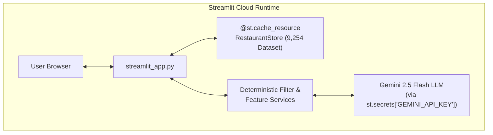

# 🚀 Crave AI — Streamlit Deployment Plan

This document outlines the end-to-end strategy, architecture, and step-by-step execution plan for deploying **Crave AI** as an interactive, production-ready web application on **Streamlit Community Cloud** (or Hugging Face Spaces).

---

## 📌 1. Architecture Overview

### Why Streamlit?
Streamlit allows the entire Crave AI engine (Deterministic Stage-1 Filter, In-Memory `RestaurantStore`, and Gemini 2.5 Flash LLM Reasoner) to run in a single, high-performance, Python-native environment without needing separate node/vite servers or external orchestration.



---

## 🛠️ 2. Core Components to Implement

### A. `streamlit_app.py` (Main Application Entry Point)
A multi-tab Streamlit dashboard offering the 4 core experiences:

1. **🔍 Discover (AI Food Discovery)**:
   - Sidebar/Panel with: Neighborhood select, Budget Tier radio, Cuisine dropdown (A-Z sorted), Min Rating slider, **Pure Veg toggle**, and **Halal Friendly toggle / Additional preferences**.
   - Output: AI Summary banner, candidate count metrics, and styled recommendation cards with explanations.

2. **🍜 Dish Radar**:
   - Dish craving search input + Quick chips (*Tonkotsu Ramen, Yemeni Mandi, Masala Dosa, Basque Cheesecake, Mutton Shawarma, Korean Bingsu*).
   - Output: Matched dish quote, relevance score, and restaurant rating/location.

3. **🎲 Crave Roulette**:
   - Location + Budget + Veg/Halal filters.
   - Big animated "Spin Roulette 🎲" action button.
   - Output: Winner reveal card with **Must-Order Dish**, **Why It Won Tonight**, and **Insider Pro Foodie Tip**.

4. **👥 Group Dining Solver**:
   - Dynamic friend list builder (Friend name, diet rule, specific craving).
   - Preset buttons (*Veggie + Halal Duo*, *4-Way Squad Dilemma*).
   - Output: Harmony verdict banner, 0–100% group harmony score meter, and personalized meal recommendations per friend.

---

### B. Styling & Theming (`.streamlit/config.toml`)
Custom theme matching Crave AI's sleek dark aesthetic:

```toml
[theme]
primaryColor = "#cb202d"
backgroundColor = "#131313"
secondaryBackgroundColor = "#1f1f1f"
textColor = "#e5e2e1"
font = "sans serif"

[server]
headless = true
enableCORS = false
enableXsrfProtection = true
```

---

### C. Secrets Management (`.streamlit/secrets.toml`)
Local development and Streamlit Cloud configuration:

```toml
GEMINI_API_KEY = "AIzaSy..."
```

In Python, the app will resolve credentials seamlessly:
```python
import os
import streamlit as st

api_key = st.secrets.get("GEMINI_API_KEY", os.getenv("GEMINI_API_KEY"))
```

---

## 📋 3. Dependencies Configuration (`requirements.txt`)

Ensure `requirements.txt` contains all runtime dependencies:

```text
streamlit>=1.38.0
pandas>=2.0.0
pyarrow>=14.0.0
google-generativeai>=0.8.0
pydantic>=2.0.0
python-dotenv>=1.0.0
fastapi>=0.110.0
uvicorn>=0.28.0
pytest>=8.0.0
```

---

## 🚀 4. Step-by-Step Streamlit Cloud Deployment Guide

### Step 1: Push `streamlit_app.py` & `.streamlit/config.toml` to GitHub
Ensure all Streamlit code and configuration are committed to your repo `danias120/Zomato-Milstone1` on branch `main`.

### Step 2: Connect Streamlit Community Cloud
1. Navigate to [share.streamlit.io](https://share.streamlit.io).
2. Sign in with your GitHub account (`danias120`).
3. Click **"New app"** (or **"Create app"**).

### Step 3: Configure Repository Settings
* **Repository**: `danias120/Zomato-Milstone1`
* **Branch**: `main`
* **Main file path**: `streamlit_app.py`
* **App URL** (Optional custom subdomain): `crave-ai-bangalore.streamlit.app`

### Step 4: Configure App Secrets
1. Click **"Advanced settings..."** before deploying (or go to **Settings > Secrets** in the app dashboard).
2. Add your Gemini API key in TOML format:
   ```toml
   GEMINI_API_KEY = "your_actual_gemini_api_key_here"
   ```
3. Click **Save**.

### Step 5: Deploy & Monitor
1. Click **"Deploy!"**.
2. Streamlit Cloud will install dependencies from `requirements.txt`, load the cached dataset, and launch the live URL within 1–2 minutes.

---

## ⚡ 5. Performance & Caching Optimizations

| Optimization | Implementation | Benefit |
| :--- | :--- | :--- |
| **Dataset In-Memory Caching** | `@st.cache_resource` on `get_restaurant_store()` | Loads 9,254 restaurants once; subsequent queries are instantaneous (<5ms). |
| **LLM Call Caching** | `@st.cache_data(ttl=3600)` on Gemini responses | Prevents redundant API calls for identical filter queries. |
| **Cold Start Minimization** | Pre-bundled Parquet cache in `data/cache/` | Instant dataset hydration without remote downloads. |

---

## 🛡️ 6. Verification & Launch Checklist

- [ ] `streamlit_app.py` runs locally with `streamlit run streamlit_app.py`.
- [ ] All 4 tabs (Discover, Dish Radar, Roulette, Group Dining) function without errors.
- [ ] Pure Veg and Halal Friendly filters correctly isolate eligible restaurants.
- [ ] Missing API key displays a friendly error banner instructing user to add key.
- [ ] Responsive on mobile and tablet viewport sizes.
- [ ] Streamlit Cloud deployment build passes with green health status.
