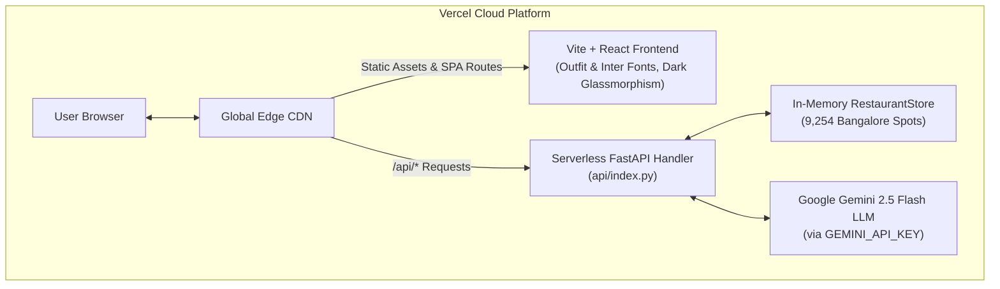

# 🚀 Crave AI — Fullstack Vercel Deployment Plan

This document outlines the architecture, configuration, and step-by-step deployment guide for deploying **Crave AI** as a high-performance, fullstack web application on **Vercel** (React/Vite Frontend + Serverless Python FastAPI Backend).

---

## 📌 1. Architecture Overview



### Key Advantages:
* **Single Domain & Zero CORS Issues**: Frontend and Backend live under the exact same domain (e.g., `https://crave-ai.vercel.app`).
* **Instant Static Delivery**: React bundle with modern glassmorphism, Google Fonts, and micro-animations served globally via Vercel Edge Network.
* **Auto-Scaling Serverless API**: Python FastAPI routes (`/api/recommendations`, `/api/dish-search`, `/api/roulette`, `/api/group-recommendations`) scale on demand.

---

## 🛠️ 2. Repository Configuration

### A. Vercel Monorepo Config (`vercel.json`)
```json
{
  "version": 2,
  "builds": [
    {
      "src": "api/index.py",
      "use": "@vercel/python"
    },
    {
      "src": "frontend/package.json",
      "use": "@vercel/static-build",
      "config": {
        "distDir": "dist"
      }
    }
  ],
  "routes": [
    {
      "src": "/api/(.*)",
      "dest": "api/index.py"
    },
    {
      "handle": "filesystem"
    },
    {
      "src": "/(.*)",
      "dest": "/index.html"
    }
  ]
}
```

### B. Serverless Python Entrypoint (`api/index.py`)
```python
import os
import sys
from pathlib import Path

# Add project root to sys.path
ROOT_DIR = Path(__file__).resolve().parent.parent
if str(ROOT_DIR) not in sys.path:
    sys.path.insert(0, str(ROOT_DIR))

from src.api.app import app

__all__ = ["app"]
```

### C. Frontend API Client (`frontend/src/api/client.ts`)
Configured to use `http://localhost:8000` during local development and relative `/` path in production:
```typescript
const api = axios.create({
  baseURL: import.meta.env.VITE_API_URL || (import.meta.env.DEV ? 'http://localhost:8000' : ''),
  timeout: 60000,
  headers: { 'Content-Type': 'application/json' },
});
```

---

## 🚀 3. Step-by-Step Vercel Deployment Guide

### Step 1: Open Vercel Dashboard
1. Go to [vercel.com](https://vercel.com) and log in with your GitHub account (`danias120`).

### Step 2: Import the GitHub Repository
1. Click **"Add New..."** ➔ **"Project"**.
2. Find and select **`danias120/Zomato-Milstone1`** (or `danias120/Crave-AI`).

### Step 3: Project Configuration
* **Framework Preset**: Leave as default (`Vite` / Other).
* **Root Directory**: `./` (leave default).
* **Build Command**: Automatically read from `vercel.json`.
* **Output Directory**: Automatically read from `vercel.json`.

### Step 4: Configure Environment Variables
Under **Environment Variables**, add:
| Key | Value | Description |
| :--- | :--- | :--- |
| `GEMINI_API_KEY` | `AIzaSy...` | Your Google Gemini API Key |

### Step 5: Click "Deploy"
Vercel will compile the React bundle and deploy the Python Serverless function. Your app will be live within ~1 minute!

---

## 🧪 4. Local Testing & Verification

### Running Fullstack Locally:

1. **Start Backend (FastAPI)**:
   ```bash
   uvicorn src.api.app:app --host 0.0.0.0 --port 8000 --reload
   ```

2. **Start Frontend (Vite React)**:
   ```bash
   cd frontend
   npm run dev
   ```
   Open [http://localhost:5173](http://localhost:5173) in your browser.

3. **Run Unit & Integration Tests**:
   ```bash
   .venv/bin/pytest
   ```
