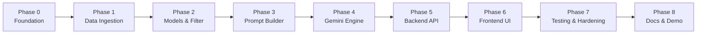
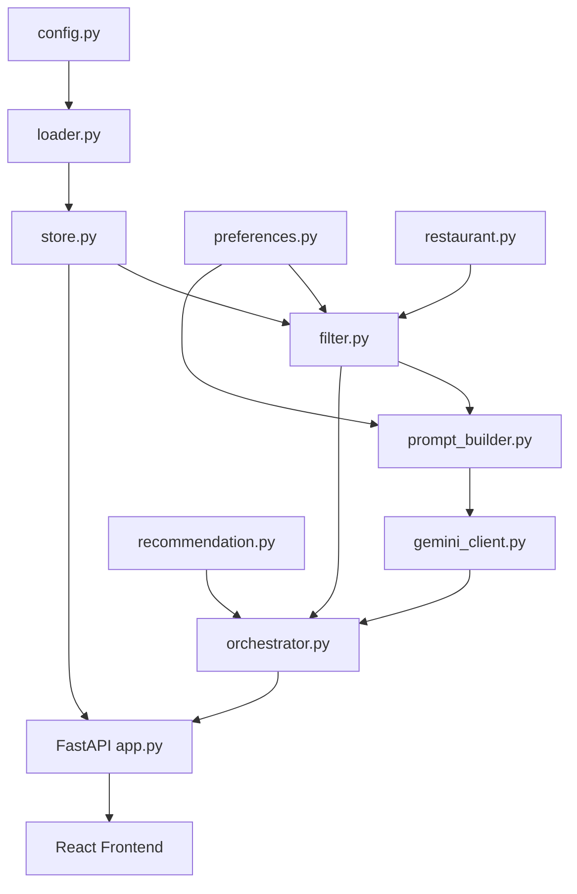

# Phase-Wise Implementation Plan

> AI-Powered Restaurant Recommendation System (Zomato Milestone 1)  
> Based on [context.md](./context.md) and [architecture.md](./architecture.md)

## Overview

This plan breaks implementation into **8 phases**, ordered by dependency. Each phase maps to components in the architecture and stages in the project context. Phases are designed to deliver incremental, testable value—each ending with a verifiable milestone.

### Guiding Principles

| Principle | Source |
|-----------|--------|
| Filter before Gemini | [architecture.md §5.3](./architecture.md) |
| Restaurant facts from dataset; ranking/explanation from Gemini | [context.md](./context.md) |
| Structured JSON in / JSON out | [architecture.md §5.4](./architecture.md) |
| FastAPI backend + React frontend for Milestone 1 | [architecture.md §4](./architecture.md) |

### Tech Stack (Locked)

| Layer | Choice |
|-------|--------|
| Language | Python 3.11+ (backend), TypeScript (frontend) |
| Backend API | FastAPI |
| Frontend | React + Vite |
| Data | Hugging Face `datasets` + pandas |
| LLM | Google Gemini (`google-generativeai`, `gemini-2.0-flash`) |
| Validation | Pydantic (backend), Zod (frontend) |
| Config | `.env` + `pydantic-settings` |

### Phase Map



| Phase | Context workflow stage | Primary deliverable |
|-------|------------------------|---------------------|
| 0 | — | Runnable project skeleton |
| 1 | Data Ingestion | Cached, normalized restaurant store |
| 2 | User Input (backend) | Filter service + preference models |
| 3 | Integration Layer | Prompt builder + candidate pipeline |
| 4 | Recommendation Engine | Gemini client + response parser |
| 5 | API Layer | FastAPI REST API + CORS + endpoints |
| 6 | Output Display | React + Vite premium frontend |
| 7 | — | Tests, error handling, fallbacks |
| 8 | — | README, demo-ready app |

---

## Phase 0: Project Foundation

**Goal:** Establish repo structure, dependencies, and configuration so later phases plug in cleanly.

**Depends on:** Nothing

### Tasks

- [x] Create directory layout per [architecture.md §9](./architecture.md):
  - `src/`, `src/models/`, `src/data/`, `src/services/`, `tests/`, `data/cache/`
- [x] Add `requirements.txt`:
  - `streamlit`, `pandas`, `datasets`, `google-generativeai`, `pydantic`, `pydantic-settings`, `python-dotenv`, `pytest`
- [x] Add `.env.example` with:
  - `GEMINI_API_KEY`, `GEMINI_MODEL`, `GEMINI_MAX_OUTPUT_TOKENS`, `GEMINI_TEMPERATURE`
  - `TOP_K_RECOMMENDATIONS`, `MAX_CANDIDATES_FOR_GEMINI`
- [x] Implement `src/config.py` using `pydantic-settings` to load env vars
- [x] Add `.gitignore` (`.env`, `data/cache/`, `__pycache__/`, `.venv/`)
- [x] Create virtual environment and verify imports

### Deliverables

| Artifact | Path |
|----------|------|
| Config module | `src/config.py` |
| Dependency manifest | `requirements.txt` |
| Env template | `.env.example` |

### Acceptance Criteria

- [x] `python -c "from src.config import settings"` runs without error
- [x] Secrets are not committed; `.env.example` documents all required keys

**Estimated effort:** 0.5 day

---

## Phase 1: Data Ingestion

**Goal:** Load the Zomato dataset from Hugging Face, normalize it, cache locally, and expose an in-memory store.

**Depends on:** Phase 0

**Maps to:** Context §1 · Architecture §5.1

### Tasks

- [x] Implement `src/models/restaurant.py`:
  - `Restaurant` Pydantic model (`id`, `name`, `location`, `cuisines`, `rating`, `cost_for_two`, `budget_tier`)
  - `BudgetTier` enum: `low` | `medium` | `high`
- [x] Implement `src/data/loader.py`:
  - Load `ManikaSaini/zomato-restaurant-recommendation` via Hugging Face `datasets`
  - Inspect raw schema; map columns to canonical `Restaurant` fields
  - Normalize locations (trim, consistent casing)
  - Parse cost field → numeric `cost_for_two` + `budget_tier` buckets
  - Coerce ratings to float; skip invalid rows with logging
  - Persist processed data to `data/cache/restaurants.parquet` (or JSON)
- [x] Implement `src/data/store.py`:
  - `RestaurantStore` class holding list/DataFrame of `Restaurant` objects
  - Methods: `get_all()`, `get_by_id(id)`, `distinct_locations()`, `distinct_cuisines()`
  - Load from cache on startup; re-fetch from Hugging Face if cache missing
- [x] Add a one-off script or CLI entry to warm the cache:
  - `python -m src.data.loader` (or similar)

### Deliverables

| Artifact | Path |
|----------|------|
| Restaurant model | `src/models/restaurant.py` |
| Dataset loader | `src/data/loader.py` |
| In-memory store | `src/data/store.py` |
| Local cache | `data/cache/restaurants.parquet` |

### Acceptance Criteria

- [x] Dataset downloads and caches successfully on first run
- [x] Second run loads from cache without re-downloading
- [x] `distinct_locations()` and `distinct_cuisines()` return non-empty lists
- [x] Sample restaurants have valid `rating`, `budget_tier`, and `name`

### Validation Script

```bash
python -c "
from src.data.store import RestaurantStore
store = RestaurantStore()
print(len(store.get_all()), 'restaurants loaded')
print('Locations:', store.distinct_locations()[:5])
"
```

**Estimated effort:** 1–1.5 days

---

## Phase 2: User Preferences & Filter Service

**Goal:** Define user input models and implement deterministic pre-filtering before Gemini is invoked.

**Depends on:** Phase 1

**Maps to:** Context §2 · Architecture §5.2, §5.3.1

### Tasks

- [x] Implement `src/models/preferences.py`:
  - `UserPreferences` model: `location`, `budget`, `cuisine`, `min_rating`, `additional_preferences`
  - Validators: required fields, budget enum, rating clamped 0–5, max length on free text
- [x] Implement `src/services/filter.py`:
  - `filter_restaurants(store, prefs) -> list[Restaurant]`
  - Apply filters in order: location → cuisine → min_rating → budget tier
  - Case-insensitive location/cuisine matching
  - Cap results at `MAX_CANDIDATES_FOR_GEMINI`; if over cap, sort by rating desc and truncate
  - Return empty list when no matches (no Gemini call downstream)
- [x] Write unit tests `tests/test_filter.py`:
  - Fixture dataset with known restaurants
  - Tests for each filter dimension and combined filters
  - Test zero-match and over-cap truncation

### Deliverables

| Artifact | Path |
|----------|------|
| Preferences model | `src/models/preferences.py` |
| Filter service | `src/services/filter.py` |
| Filter tests | `tests/test_filter.py` |

### Acceptance Criteria

- [x] Filtering by location + cuisine + rating + budget returns expected subset
- [x] Zero candidates when criteria are too strict
- [x] Candidate count never exceeds `MAX_CANDIDATES_FOR_GEMINI`
- [x] `pytest tests/test_filter.py` passes

**Estimated effort:** 1 day

---

## Phase 3: Integration Layer — Prompt Builder

**Goal:** Convert filtered candidates and user preferences into a structured Gemini prompt with strict JSON output instructions.

**Depends on:** Phase 2

**Maps to:** Context §3 · Architecture §5.3.2

### Tasks

- [x] Implement `src/models/recommendation.py`:
  - `GeminiRecommendationItem` (parsed from LLM): `restaurant_id`, `rank`, `explanation`
  - `GeminiRawResponse`: `summary`, `recommendations`
  - `Recommendation`, `RecommendationResponse` (final API/UI shape)
- [x] Implement `src/services/prompt_builder.py`:
  - `build_system_instruction() -> str` — role, guardrails, no fabrication rule
  - `build_user_prompt(prefs, candidates) -> str` — structured JSON of prefs + candidate list
  - `build_output_schema_hint() -> str` — expected JSON shape
  - Sanitize `additional_preferences` (strip control chars, enforce max length)
  - Include instruction: only recommend from provided `restaurant_id` values
- [x] Write tests `tests/test_prompt_builder.py`:
  - Snapshot or assert key sections present in prompt
  - Verify all candidate IDs appear in prompt body
  - Verify user prefs are embedded

### Prompt Output Contract

Gemini must return JSON matching:

```json
{
  "summary": "string",
  "recommendations": [
    {
      "restaurant_id": "string",
      "rank": 1,
      "explanation": "string"
    }
  ]
}
```

### Deliverables

| Artifact | Path |
|----------|------|
| Recommendation models | `src/models/recommendation.py` |
| Prompt builder | `src/services/prompt_builder.py` |
| Prompt tests | `tests/test_prompt_builder.py` |

### Acceptance Criteria

- [x] Prompt includes user preferences, candidate JSON, and output schema
- [x] Guardrails explicitly forbid inventing restaurants
- [x] `pytest tests/test_prompt_builder.py` passes

**Estimated effort:** 1 day

---

## Phase 4: Recommendation Engine — Gemini Client

**Goal:** Call Google Gemini, parse JSON responses, merge AI output with dataset records, and handle failures gracefully.

**Depends on:** Phase 3

**Maps to:** Context §4 · Architecture §5.4

### Tasks

- [x] Implement `src/services/gemini_client.py`:
  - Initialize `google.generativeai` with `GEMINI_API_KEY`
  - `GenerativeModel` with `system_instruction` and `generation_config`:
    - `response_mime_type="application/json"`
    - `temperature`, `max_output_tokens` from config
  - `generate_recommendations(system_instruction, user_prompt) -> GeminiRawResponse`
  - Timeout handling (30s default)
  - Retry once on JSON parse failure with "return valid JSON only" follow-up
- [x] Implement response parsing in `gemini_client.py` or separate `response_parser.py`:
  - Parse JSON → `GeminiRawResponse`
  - Validate `restaurant_id` exists in candidate set
  - Map IDs to `Restaurant` objects → `list[Recommendation]`
  - Sort by `rank`; limit to `TOP_K_RECOMMENDATIONS`
- [x] Implement fallback path:
  - On Gemini timeout/error: return top-N by rating with template explanations
- [x] Implement `src/services/orchestrator.py`:
  - `get_recommendations(store, prefs) -> RecommendationResponse`
  - Pipeline: filter → early exit if empty → prompt → Gemini → parse → merge
  - Populate `meta.candidate_count` and `meta.filters_applied`
- [x] Optional: integration test with real Gemini API (skipped in CI if no key)

### Deliverables

| Artifact | Path |
|----------|------|
| Gemini client | `src/services/gemini_client.py` |
| Orchestrator | `src/services/orchestrator.py` |
| Optional parser module | `src/services/response_parser.py` |

### Acceptance Criteria

- [x] Valid Gemini response produces ranked `RecommendationResponse`
- [x] Invalid/fabricated `restaurant_id` in response is rejected or ignored
- [x] Gemini failure triggers rating-based fallback without crashing
- [x] Manual test with real API key returns explanations for 3–5 restaurants

### Manual Test

```bash
# Requires GEMINI_API_KEY in .env
python -c "
from src.data.store import RestaurantStore
from src.models.preferences import UserPreferences
from src.services.orchestrator import get_recommendations
store = RestaurantStore()
prefs = UserPreferences(location='Bangalore', budget='medium', cuisine='North Indian', min_rating=4.0)
result = get_recommendations(store, prefs)
print(result.summary)
for r in result.recommendations:
    print(r.rank, r.restaurant.name, r.explanation[:80])
"
```

**Estimated effort:** 1.5–2 days

---

## Phase 5: Backend API — FastAPI REST Service

**Goal:** Expose the recommendation engine as a RESTful API with proper CORS, validation, and documentation so the frontend can consume it independently.

**Depends on:** Phase 4

**Maps to:** Architecture §3 (Application Layer), §5.2

### Tasks

- [ ] Add FastAPI dependencies to `requirements.txt`:
  - `fastapi`, `uvicorn[standard]`
- [ ] Implement `src/api/__init__.py`
- [ ] Implement `src/api/app.py` (FastAPI application factory):
  - Create FastAPI app with title, description, version
  - Configure CORS middleware (allow `http://localhost:5173` for Vite dev server)
  - Lifespan event: load `RestaurantStore` on startup, store in `app.state`
  - Include API routers
- [ ] Implement `src/api/routes/recommendations.py`:
  - `POST /api/recommendations` — accepts `UserPreferences` body, returns `RecommendationResponse`
  - Request validation via Pydantic (reuses existing models)
  - Error handling: 400 for invalid input, 503 for Gemini failures, 500 for unexpected errors
  - Response model with proper JSON schema for frontend consumption
- [ ] Implement `src/api/routes/metadata.py`:
  - `GET /api/locations` — returns list of distinct locations
  - `GET /api/cuisines` — returns list of distinct cuisines
  - `GET /api/health` — returns health status + restaurant count
- [ ] Implement `src/api/dependencies.py`:
  - Dependency injection for `RestaurantStore`
  - Shared lifespan context
- [ ] Add structured error responses:
  - `ErrorResponse` Pydantic model with `error`, `detail`, `status_code`
  - Custom exception handlers for graceful error display

### Deliverables

| Artifact | Path |
|----------|------|
| FastAPI app | `src/api/app.py` |
| Recommendation endpoints | `src/api/routes/recommendations.py` |
| Metadata endpoints | `src/api/routes/metadata.py` |
| Dependencies | `src/api/dependencies.py` |

### Run Command

```bash
uvicorn src.api.app:app --reload --port 8000
```

### Acceptance Criteria

- [ ] `GET /api/health` returns `{"status": "ok", "restaurant_count": N}`
- [ ] `GET /api/locations` and `GET /api/cuisines` return non-empty lists
- [ ] `POST /api/recommendations` with valid preferences returns ranked results
- [ ] Invalid input returns 400 with descriptive error
- [ ] Gemini failure returns 503 with fallback results or user-friendly error
- [ ] Swagger docs available at `/docs`
- [ ] CORS allows requests from `http://localhost:5173`

**Estimated effort:** 1 day

---

## Phase 6: Frontend — React + Vite Premium UI ("Crave AI")

**Goal:** Build a stunning, desktop-web-first React frontend ("Crave AI") that consumes the FastAPI backend and delivers a premium user experience with Zomato-inspired dark theme, glassmorphism cards, and polished design. Desktop is the primary target; responsive mobile support is optional/stretch.

**Depends on:** Phase 5

**Maps to:** Context §2, §5 · Architecture §5.5 (Presentation Layer)

### Tasks

- [ ] Initialize React + Vite project in `frontend/`:
  - `npx -y create-vite@latest frontend/ -- --template react-ts`
  - Install dependencies: `axios`, `framer-motion`, `react-icons`, `react-hot-toast`
- [ ] Set up design system in `frontend/src/styles/` (Zomato-inspired dark theme):
  - **Color palette:** Dark background (`#131313`), surface (`#2A2A2A`), Zomato red primary (`#CB202D`), orange accent (`#FF6B35`), gold for ratings (`#FFD700`), text (`#E5E2E1`)
  - **App branding:** Title "Crave AI" with gradient text (`#CB202D → #FF6B35`), tagline "Your AI-powered food discovery engine 🍽️"
  - **Typography:** Google Fonts — Inter for body, Outfit for headings
  - **CSS variables:** Design tokens for colors, spacing, border-radius, shadows
  - **Glassmorphism utilities:** Frosted glass cards, subtle backdrop blur
  - **Desktop-first layout:** Optimized for 1440px+ viewports, max-width 1200px centered
  - **Animations:** Smooth transitions, staggered card reveals, hover micro-interactions
- [ ] Implement `frontend/src/api/client.ts`:
  - Axios instance with base URL (`http://localhost:8000`)
  - Type-safe API functions: `getLocations()`, `getCuisines()`, `getRecommendations(prefs)`
  - Error handling with user-friendly messages
- [ ] Implement `frontend/src/types/index.ts`:
  - TypeScript interfaces mirroring backend Pydantic models
  - `UserPreferences`, `Restaurant`, `Recommendation`, `RecommendationResponse`
- [ ] Build UI components in `frontend/src/components/`:
  - **`Header.tsx`** — App logo, title with gradient text, tagline
  - **`PreferenceForm.tsx`** — Elegant form with:
    - Searchable location dropdown with glassmorphism styling
    - Budget selector with animated pill buttons (Low / Medium / High)
    - Cuisine multi-select with tag-style chips
    - Rating slider with visual star indicators
    - Additional preferences textarea with character count
    - Animated submit button with loading state
  - **`RecommendationCard.tsx`** — Premium card design:
    - Rank badge with gradient background
    - Restaurant name, cuisine tags, star rating display
    - Cost formatted as `₹X for two`
    - AI-generated explanation with subtle highlight
    - Glassmorphism card styling with hover elevation
    - Staggered entrance animation (framer-motion)
  - **`ResultsSummary.tsx`** — AI summary banner with icon and gradient border
  - **`FilterRecap.tsx`** — Applied filters shown as dismissible chips above results
  - **`EmptyState.tsx`** — Illustrated empty state with helpful suggestions
  - **`ErrorState.tsx`** — Friendly error display with retry button
  - **`LoadingState.tsx`** — Skeleton cards with shimmer animation during API call
  - **`Footer.tsx`** — Minimal footer with credits
- [ ] Assemble `frontend/src/App.tsx`:
  - Layout: Header → PreferenceForm → Results section → Footer
  - After submission: two-column layout — form sidebar (left) + results area (right)
  - State management: form state, loading state, results, errors
  - Desktop-web-first design: optimized for 1440px viewport, functional on 1024px+
- [ ] Add SEO and meta tags in `index.html`:
  - Title: "Crave AI — AI-Powered Food Discovery Engine"
  - Meta description, favicon, Open Graph tags
- [ ] Polish and optimize:
  - Smooth page transitions
  - Focus management for accessibility
  - Error boundary component
  - Loading performance optimization

### Deliverables

| Artifact | Path |
|----------|------|
| Vite + React app | `frontend/` |
| API client | `frontend/src/api/client.ts` |
| Component library | `frontend/src/components/` |
| Design system | `frontend/src/styles/` |
| Type definitions | `frontend/src/types/index.ts` |

### Run Command

```bash
# Terminal 1 — Backend
uvicorn src.api.app:app --reload --port 8000

# Terminal 2 — Frontend
cd frontend && npm run dev
```

### Acceptance Criteria

- [ ] App launches with a visually stunning dark-themed UI
- [ ] User can select location, budget, cuisine, and rating from styled form elements
- [ ] Submitting preferences shows skeleton loading animation, then recommendation cards
- [ ] Each card displays: rank, name, cuisine, star rating, cost (₹), AI explanation
- [ ] Cards animate in with staggered entrance (framer-motion)
- [ ] No-match case shows illustrated empty state with suggestions
- [ ] API errors show friendly error message with retry option
- [ ] Optimized for desktop/laptop (1440px+), functional on 1024px+
- [ ] End-to-end flow works: form → API call → loading → display results

**Estimated effort:** 2–3 days

---

## Phase 7: Testing, Error Handling & Hardening

**Goal:** Improve reliability, observability, and test coverage before demo delivery.

**Depends on:** Phase 6

**Maps to:** Architecture §10

### Tasks

- [ ] Expand test suite:
  - [ ] `tests/test_filter.py` — edge cases (empty store, boundary ratings)
  - [ ] `tests/test_prompt_builder.py` — injection-style input in `additional_preferences`
  - [ ] `tests/test_orchestrator.py` — mock Gemini client; test empty candidates, fallback path
  - [ ] `tests/test_gemini_client.py` — mock API responses; malformed JSON retry
  - [ ] `tests/test_api.py` — FastAPI TestClient tests for all endpoints
- [ ] Add structured logging:
  - Log candidate count after filter
  - Log Gemini latency and success/failure
  - Do not log full prompts or API keys
- [ ] Harden input validation:
  - Max length on `additional_preferences`
  - Reject unknown location/cuisine values from dropdown (already constrained in UI)
- [ ] Verify error paths:
  - Missing `GEMINI_API_KEY` → clear startup error
  - Gemini 502 → fallback or user message
  - JSON parse failure → retry then fallback
  - Frontend gracefully handles network errors
- [ ] Run full test suite: `pytest tests/ -v`

### Deliverables

| Artifact | Path |
|----------|------|
| API endpoint tests | `tests/test_api.py` |
| Orchestrator tests | `tests/test_orchestrator.py` |
| Gemini client tests | `tests/test_gemini_client.py` |
| Logging in services | `src/services/*.py` |

### Acceptance Criteria

- [ ] `pytest tests/ -v` passes (integration tests may skip without API key)
- [ ] App does not crash on Gemini failure
- [ ] Prompt injection strings in `additional_preferences` do not break JSON parsing
- [ ] Logs show filter count and Gemini latency for debugging
- [ ] API returns proper HTTP status codes for all error scenarios

**Estimated effort:** 1 day

---

## Phase 8: Documentation & Demo Readiness

**Goal:** Package the project for submission/demo with clear setup instructions and verified success criteria.

**Depends on:** Phase 7

**Maps to:** Architecture §15 · Context objectives

### Tasks

- [ ] Write `README.md`:
  - Project description and architecture summary
  - Prerequisites (Python 3.11+, Node.js 18+, Gemini API key)
  - Backend setup: venv, `pip install -r requirements.txt`, copy `.env.example` → `.env`
  - Frontend setup: `cd frontend && npm install`
  - How to warm dataset cache
  - How to run backend: `uvicorn src.api.app:app --reload --port 8000`
  - How to run frontend: `cd frontend && npm run dev`
  - Example user inputs for demo
- [ ] Verify all [success criteria](./architecture.md#15-success-criteria):
  - [ ] Recommendations grounded in Hugging Face dataset
  - [ ] Filters materially change results
  - [ ] Each result shows name, cuisine, rating, cost, explanation
  - [ ] No-match and Gemini failure handled gracefully
  - [ ] Filter and prompt builder have unit tests
- [ ] Optional: add `docker-compose.yml` for containerized demo (backend + frontend)
- [ ] Final demo walkthrough:
  - Bangalore + medium + Italian + 4.0 rating
  - Delhi + low + Chinese + 3.5 rating
  - Intentionally strict filters → empty state

### Deliverables

| Artifact | Path |
|----------|------|
| README | `README.md` |
| Optional Docker Compose | `docker-compose.yml` |

### Acceptance Criteria

- [ ] New developer can set up and run both backend + frontend from README alone
- [ ] All architecture success criteria met
- [ ] Demo script documented with 2–3 example preference sets

**Estimated effort:** 0.5 day

---

## Timeline Summary

| Phase | Focus | Effort | Cumulative |
|-------|-------|--------|------------|
| 0 | Foundation | 0.5 d | 0.5 d |
| 1 | Data ingestion | 1–1.5 d | 2 d |
| 2 | Models & filter | 1 d | 3 d |
| 3 | Prompt builder | 1 d | 4 d |
| 4 | Gemini engine | 1.5–2 d | 5.5–6 d |
| 5 | Backend API (FastAPI) | 1 d | 6.5–7 d |
| 6 | Frontend (React + Vite) | 2–3 d | 8.5–10 d |
| 7 | Testing & hardening | 1 d | 9.5–11 d |
| 8 | Docs & demo | 0.5 d | **10–11.5 d** |

*Estimates assume a single developer working full-time on Milestone 1.*

---

## Dependency Graph



---

## Risk Register

| Risk | Impact | Mitigation | Phase |
|------|--------|------------|-------|
| Hugging Face dataset schema differs from docs | Loader breaks | Inspect columns on first load; add mapping config | 1 |
| Gemini returns invalid JSON | Empty/broken UI | JSON mode + retry + rating fallback | 4 |
| Gemini API rate limits / latency | Slow or failed requests | Cap candidates; spinner in UI; fallback | 4, 5 |
| Budget tier mapping ambiguous | Wrong filter results | Document thresholds; unit test tier logic | 1, 2 |
| Prompt injection via free text | Unexpected behavior | Sanitize input; guardrails in system instruction | 3, 7 |
| CORS misconfiguration | Frontend can't reach API | Test CORS setup early; whitelist Vite dev port | 5, 6 |
| Frontend-backend contract drift | Broken API calls | Shared TypeScript types mirroring Pydantic models | 5, 6 |

---

## Optional Post-Milestone Enhancements

Not required for Milestone 1 ([architecture.md §13](./architecture.md)):

- Redis caching of Gemini responses
- Vector search for semantic preference matching
- User accounts and saved profiles
- Docker Compose deployment with health checks
- Progressive Web App (PWA) support
- Real-time recommendations with WebSockets

---

## Quick Reference: Context → Phase Mapping

| Context workflow | Implementation phase |
|------------------|----------------------|
| 1. Data Ingestion | Phase 1 |
| 2. User Input | Phase 2 (models), Phase 5 (API), Phase 6 (UI) |
| 3. Integration Layer | Phase 2 (filter), Phase 3 (prompt) |
| 4. Recommendation Engine | Phase 4 |
| 5. Output Display | Phase 6 |
